# Custom-built Security Information and Event Management (SIEM)

# 📖 Overview

This project is a full-stack cybersecurity platform that showcases a custom-built Security Information and Event Management (SIEM) solution with real-time monitoring, security event collection, audit logging, analytics, administrative controls, and AI-assisted incident investigation.

Unlike a traditional portfolio website, this platform combines a modern frontend with a custom Security Operations Platform designed to demonstrate practical cybersecurity engineering. The backend collects and processes security events, maintains audit trails, visualizes operational data, and leverages a Large Language Model (LLM) to assist with log analysis, threat investigation, and incident response.

The project demonstrates practical experience in:

- Security Engineering
- Application Security
- Detection Engineering
- Secure Software Development
- Backend API Development
- Security Analytics
- AI-Assisted Incident Response
- DevSecOps

The project demonstrates skills in:

- Security Engineering
- Secure Software Development
- Detection Engineering
- Application Security
- Backend API Development
- Security Analytics
- AI-assisted Incident Response
- DevSecOps

---

# 🏗️ System Architecture

```text

External Users / Security Events
            │
            ▼
    NGINX Reverse Proxy
    • Security Headers
    • Rate Limiting
    • Request Routing

            │
            ▼
FastAPI Security Backend
    • Authentication
    • Event Processing
    • Detection Engine
    • Audit Logging

            │
            ▼
Security Event Database
    • Alerts
    • Audit Logs
    • Inquiries
    • Configuration State

┌──────────────┴──────────────┐
▼                             ▼

AI Investigation (LLM)        Security Analytics
    • Log Analysis                • Charts
    • Threat Summary              • Metrics
    • Event Correlation           • Dashboards


└──────────────┬──────────────┘
               ▼

Portfolio & Security Dashboard
    • System Overview
    • Alerts & Incidents
    • Inquiries
    • Audit Logs
    • Analytics
    • Configuration

────────────────────────────────────────────────────────

Future Integration
        │
        ▼

Wazuh SIEM
    • Log Collection
    • Custom Decoders
    • Detection Rules
    • Alert Correlation
```
---

## 📊 System Overview
> *(screenshot: System Overview)*
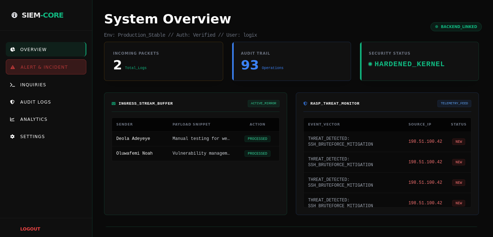

**Highlights**
Provides a centralized operational dashboard displaying:

- Backend connectivity
- Incoming security events
- Security health
- Threat monitoring
- Audit statistics
- System status

---

## 🚨 Alert & Incident Management

> *(screenshot)*
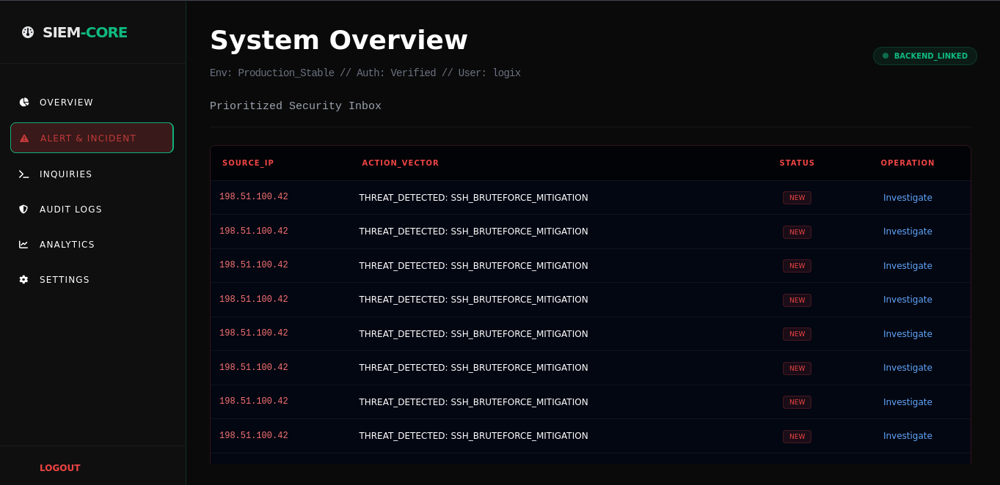

**Highlights**
Security alerts generated by the custom detection engine are displayed through a dedicated incident interface.

Capabilities include:

Planned enhancements include:

- Wazuh integration
- Sigma rule support
- MITRE ATT&CK mapping
- Threat intelligence feeds
- Multi-user SOC roles
- Automated response actions
- Email notifications
- Container monitoring
- IOC enrichment
- Advanced LLM investigation workflows

---

## 📥 Inquiry Management

> *(screenshot)*
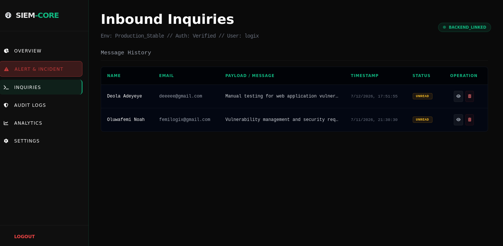

**Highlights**
A secure interface for managing inquiries submitted through the portfolio.

Features include:

- Inquiry collection
- Review workflow
- Backend processing
- Administrative management

---

## 📝 Audit Logging

> *(screenshot)*
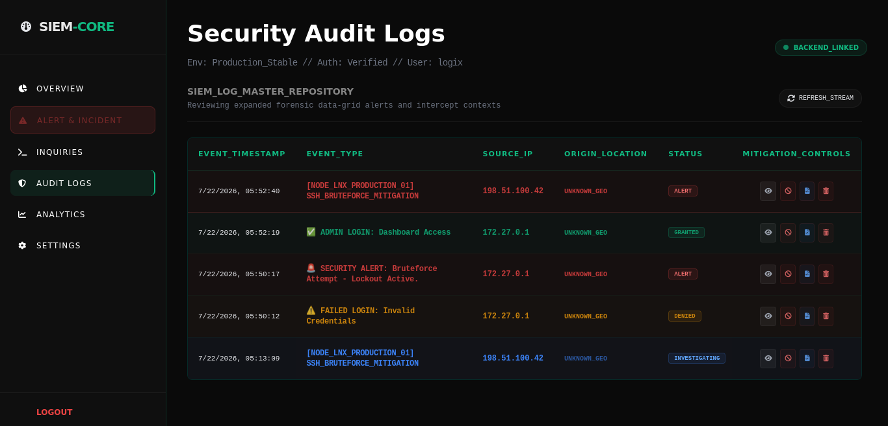

**Highlights**
Records administrative and security-related activities to provide accountability and traceability.

Examples include:

- Login events
- Administrative actions
- Configuration changes
- Security alerts
- System operations

---

## 📈 Security Analytics

> *(screenshot)*
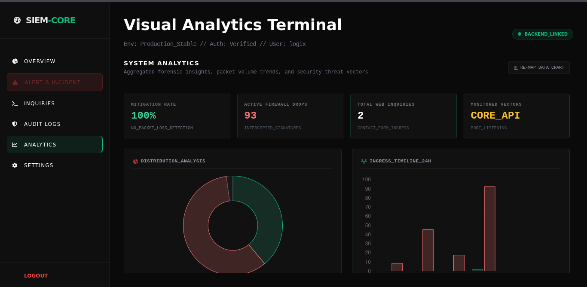

**Highlights**
Interactive dashboards visualize platform activity using charts and operational metrics.

Analytics include:

- Event distribution
- Threat frequency
- Alert statistics
- Security trends
- Operational summaries

---

## ⚙️ Security Configuration

> *(screenshot)*
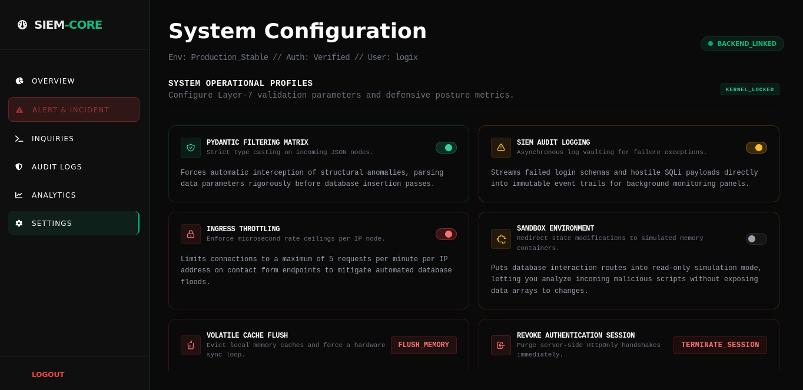

**Highlights**
Provides centralized security controls for administrative management.

Current controls include:

- Pydantic validation
- Audit logging
- Request throttling
- Sandbox mode
- Session revocation
- Cache management
- Threat threshold controls

---

## 🤖 AI-Assisted Investigation LLM

> *(screenshot)*
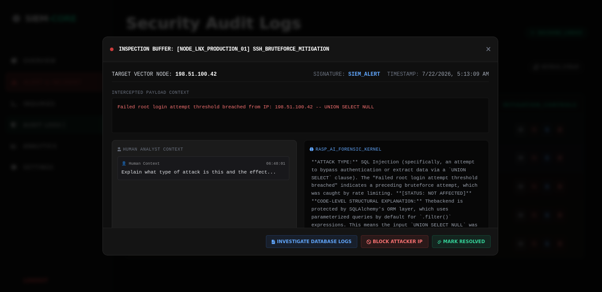

**Highlights**
An integrated Large Language Model (LLM) assists security analysts by providing additional context during investigations.

Capabilities include:

- Security log summarization
- Threat explanation
- Event correlation
- Investigation assistance
- Incident triage support

---


# 💻 Terminal & CLI Demonstrations

The following terminal outputs demonstrate the operational components of the platform during development and testing.

---

## FastAPI Backend

> *(screenshot of Uvicorn running)*
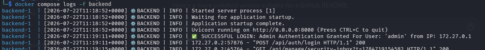

Shows:

- API startup
- Incoming requests
- HTTP responses
- Backend logging

---

## Docker Containers

> *(screenshot of `docker ps` or `docker compose ps`)*
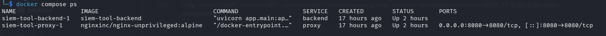

Shows:

- Running services
- Container health
- Exposed ports

---

## Security Event Processing

> *(screenshot of security events in the terminal)*
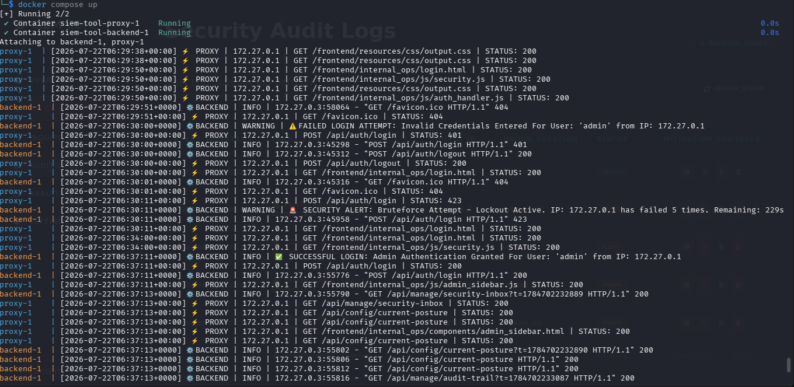

Shows:

- Incoming security events
- Detection engine processing
- Event normalization

---

## Audit Log Output

> *(screenshot of audit logs)*
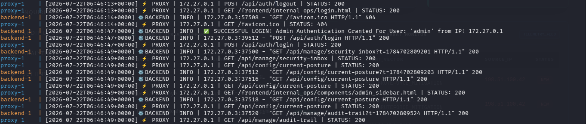

Shows:

- Authentication events
- Administrative actions
- Configuration changes
- Security audit records

---

## AI Investigation

> *(screenshot of LLM log analysis output)*
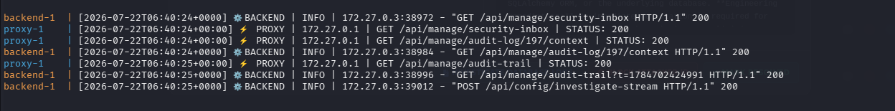


Shows:

- Log summarization
- Threat explanation
- Event correlation
- Investigation assistance

---
